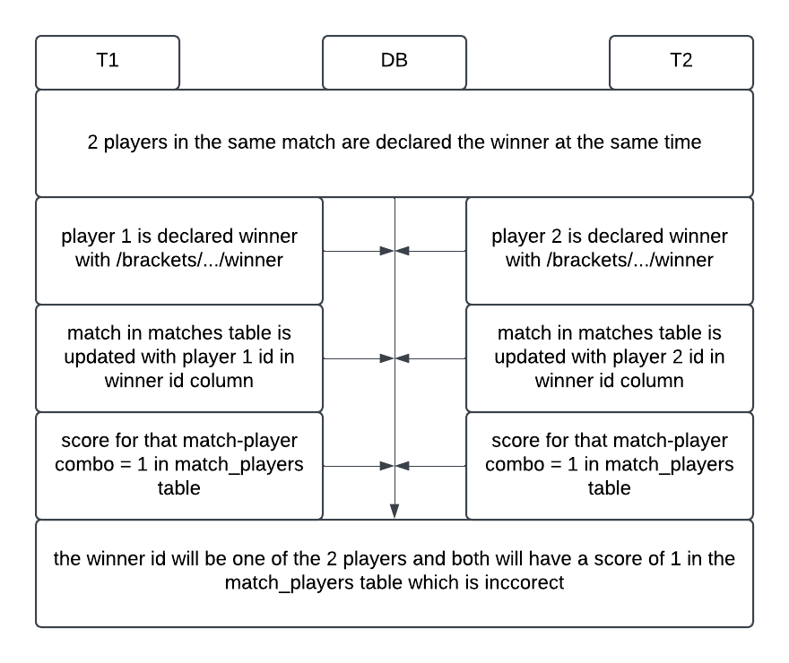

# Concurrency Issues

## Lost Update
### 2 Winners declared for the same bracket in the same match at the same time
If 2 different valid winners are declared at the exact same time, one would successfully update and the other would be lost. Since there is a select statement that gets the correct match, and it checks that there is no winner yet, it could potentially get the match with no winner on both, update on one, and then try to update again but it gets lost. 

To address this, we ensured that the match winner is only updated within the same query as when it selects the correct match using CTEs which makes it atomic because its in the same query. Because only 1 update will go through now, the following query that updates the score will not run for both because it is dependent on the id returned by the initial update.

## Dirty Read
### There is an attempt to start a bracket but it fails due to incorrect parameters and an attempt with correct parameters is also called right after
Say for the beginner_limit in /brackets/{bracket_id}/start is 0 and thus creates a divide by 0 error (assuming the formula did not account for a 0 in the denominator). But because that SQL statement happens after the statement that updates the start status of the bracket from false to true, if a corrected call is made before the incorrect one fails and the corrected call reads the uncommitted start status, it would also error out because the bracket would be seen as already started even if its uncommited.

This is thankfully automatically handled because we are using postgres which does not have a read uncommited isolation level, instead the default and lowest isolation level is read committed which does not allow transactions to read updates in transactions that have not fully finished successfully (say it errors out). This completely prevents dirty reads from happening.