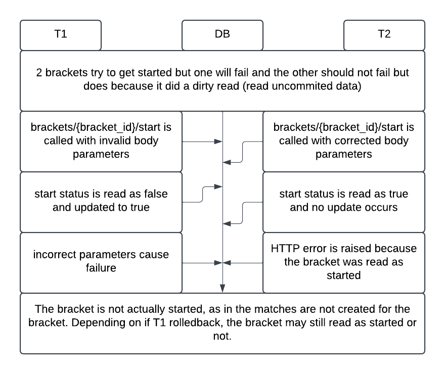

# Concurrency Issues

## Lost Update
### 2 Winners declared for the same bracket in the same match at the same time
If 2 different valid winners are declared at the exact same time, one would successfully update and the other would be lost. Since there is a select statement that gets the correct match, and it checks that there is no winner yet, it could potentially get the match with no winner on both, update on one, and then try to update again but it gets lost. 

To address this, we ensured that the match winner is only updated within the same query as when it selects the correct match using CTEs which makes it atomic because its in the same query. Because only 1 update will go through now, the following query that updates the score will not run for both because it is dependent on the id returned by the initial update.

## Dirty Read
### There is an attempt to start a bracket but it fails due to incorrect parameters and an attempt with correct parameters is also called right after
Say for the beginner_limit in /brackets/{bracket_id}/start is 0 and thus creates a divide by 0 error (assuming the formula did not account for a 0 in the denominator). But because that SQL statement happens after the statement that updates the start status of the bracket from false to true, if a corrected call is made before the incorrect one fails and the corrected call reads the uncommitted start status, it would also error out because the bracket would be seen as already started even if its uncommited.

This is thankfully automatically handled because we are using postgres which does not have a read uncommited isolation level, instead the default and lowest isolation level is read committed which does not allow transactions to read updates in transactions that have not fully finished successfully (say it errors out). This completely prevents dirty reads from happening.

## Non Repeatable Read
### When initial bracket matches are formed, a winner is declared before they get the bye
It is possible to declare a winner when the bracket is being started where in a player that normally would get a bye (which should not increase their seed score because a bye does not count as a win) instead is declared a winner of their respective match. 
This would not change the current bracket at all because they would still just advance to the next round, but the data would be incorrect and had that row been read before the winner is declared and once the bracket starts it would be different.

Postgres could handle this with snapshots, however for this specific example the simplest solution was simply to check that the count of matches that have the given match id and do not have a null player_id. This is because each match_id will be represented twice on this table one for each player, but if the player_id is null, that will be used to give the opponent a bye.